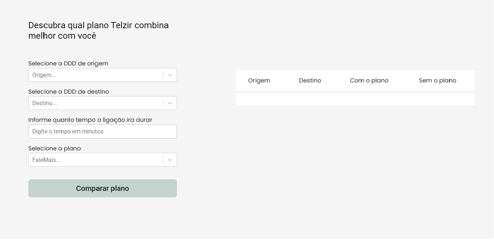
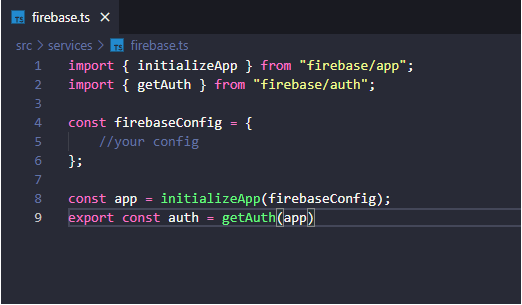

# Telzir

---

Teste prático para vaga de desenvolvedor na empresa LOLDESIGN.

<p align="center">
  
</p>

## 🏁 Iniciando
Antes de começar, certifique-se de que seu computador tenha as versões do Node >= 8.10 e npm >= 5.6.

### Rodando o projeto
Após clonar o repositório, acesse o diretório do projeto via terminal e instale as dependências usando:

```
npm install
```

Após instalar as depêndencias configure as variaveis do [Firebase](https://firebase.google.com/) em `src/services/firebase.ts`

<p align="left">
  
</p>

Após finalizar a instalação e a configuração do Firebase inicie o ambiente de desenvolvimento utilizando o comando:

```
npm start
or
yarn start
```

A aplicação estará disponível em: http://localhost:3000/

## ⛏️ Ferramentas Utilizadas
- [React](https://pt-br.reactjs.org/docs/getting-started.html) 
- [Firebase](https://firebase.google.com/)
- [Typescript](https://www.typescriptlang.org/docs/)
- [CSS](https://developer.mozilla.org/pt-BR/docs/Web/CSS)
- [HTML](https://www.w3schools.com/html/)

---

<p align="center">Made with 💜 by Davy de Souza</p>
